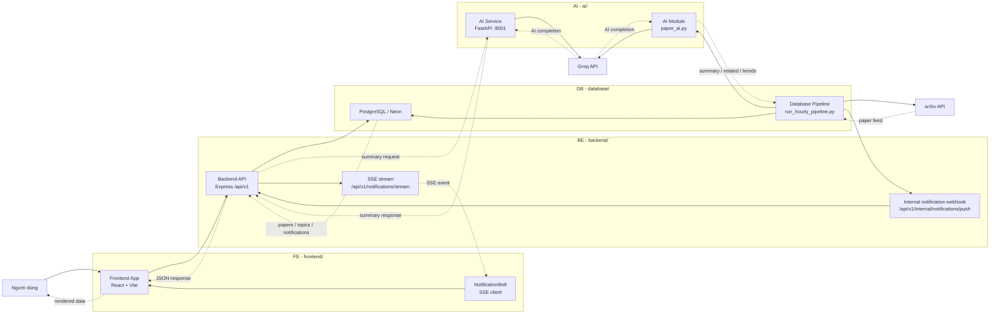
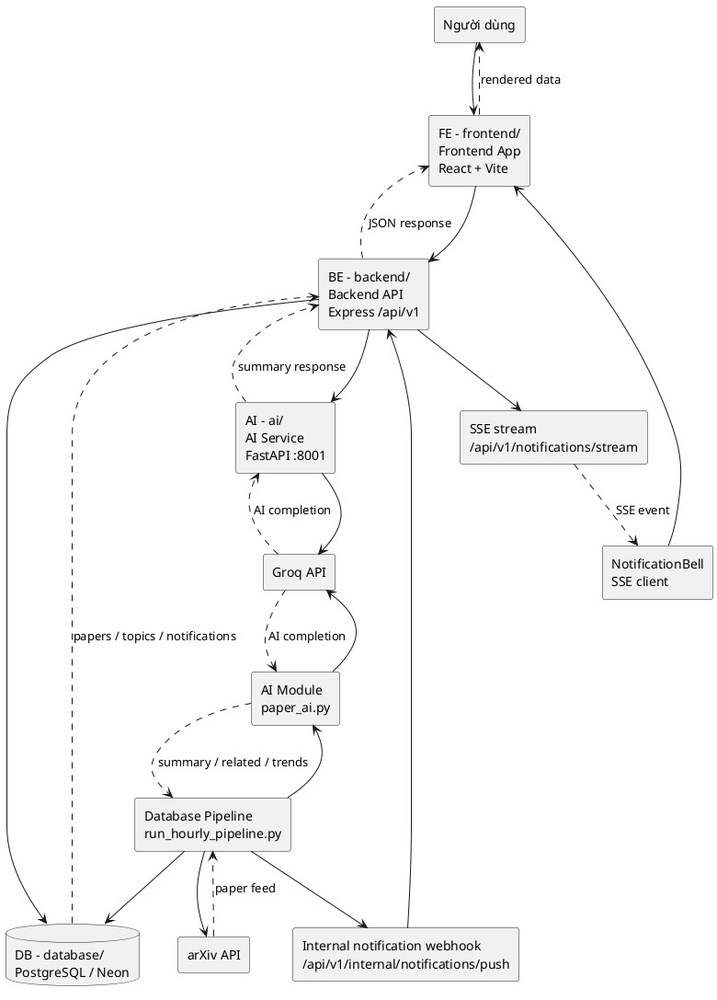
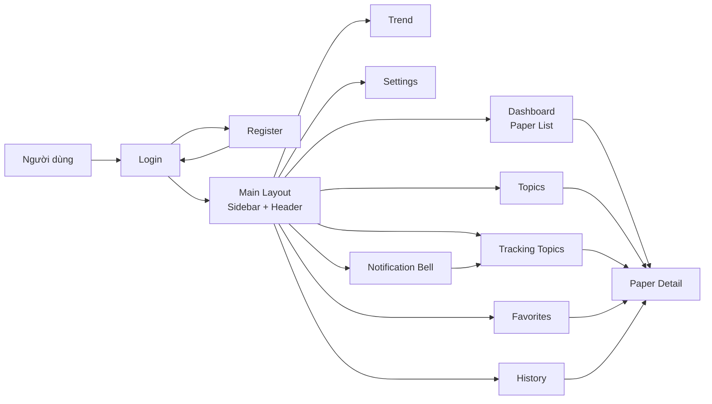

# web-paper-tracker-system
AI-powered research paper tracking system

## 1. Deployment Guide

Repo có script `start_all.py` để start nhanh 4 phần chính:

```txt
1. Backend API
2. Frontend app
3. AI summary service
4. Database crawler/hourly pipeline
```

### 1.1. Yêu Cầu Trước Khi Chạy

Các module cần được setup dependencies trước:

```powershell
cd backend
npm install
```

```powershell
cd frontend
npm install
```

```powershell
cd ai
py -3.11 -m venv .venv
.\.venv\Scripts\activate
pip install -r requirements.txt
```

```powershell
cd database
py -3.11 -m venv .venv
.\.venv\Scripts\activate
pip install -r requirements.txt
```

Cần có các file `.env` phù hợp:

```txt
backend/.env
database/.env
ai/.env
```

Frontend có thể chạy không cần `.env` vì đã có default API URL trong code. Nếu muốn cấu hình rõ theo môi trường, có thể tạo thêm:

```txt
frontend/.env
```

### 1.2. Cấu Hình File `.env`

Không commit các file `.env` lên Git. Các giá trị dưới đây là mẫu cấu hình, cần thay bằng thông tin thật trên máy hoặc Neon/Groq của bạn.

#### 1.2.1. Backend `.env`

Tạo file:

```txt
backend/.env
```

Nội dung mẫu:

```env
# Required: Backend không chạy nếu thiếu 2 biến này.
DATABASE_URL=postgresql://<username>:<password>@<host>/<dbname>?sslmode=require
JWT_SECRET=change_me_to_a_long_random_secret

# Optional: app/server defaults.
NODE_ENV=development
PORT=8000
JWT_EXPIRES_IN=7d
AI_SERVICE_URL=http://localhost:8001

# Optional: realtime notification DB pipeline -> BE -> FE.
# Phải khớp với BACKEND_INTERNAL_SECRET trong database/.env.
INTERNAL_API_SECRET=change_me_internal_secret

# Optional: manual crawler settings.
# Có thể bỏ trống DATABASE_PIPELINE_PYTHON để Backend tự ưu tiên database/.venv.
DATABASE_PIPELINE_PYTHON=
MANUAL_CRAWLER_TIMEOUT_MS=300000
MANUAL_CRAWLER_COOLDOWN_MS=20000
```

Ghi chú:

- `DATABASE_URL` phải trỏ tới cùng database với module `database`.
- `AI_SERVICE_URL` là URL của AI service, mặc định chạy ở `http://localhost:8001`.
- `JWT_SECRET` nên là chuỗi dài, khó đoán, không dùng giá trị mẫu khi deploy.
- `INTERNAL_API_SECRET` phải khớp với `BACKEND_INTERNAL_SECRET` trong `database/.env` nếu dùng realtime notification.
- `DATABASE_PIPELINE_PYTHON` có thể bỏ trống; Backend sẽ tự ưu tiên `database/.venv` khi gọi nút refresh/crawler thủ công.
- `MANUAL_CRAWLER_TIMEOUT_MS` giới hạn thời gian tối đa cho một job crawler thủ công; mặc định 300 giây.
- `MANUAL_CRAWLER_COOLDOWN_MS` giới hạn spam nút tải lại thủ công; mặc định 20 giây.
- Backend hiện không dùng `ARXIV_MAX_RESULTS` và `CRAWLER_CRON`; crawler/scheduler chính nằm ở module `database`.

#### 1.2.2. Database `.env`

Tạo file:

```txt
database/.env
```

Nội dung mẫu:

```env
# Required: dùng cho migration, seed, crawler và hourly pipeline.
DATABASE_URL=postgresql://<username>:<password>@<host>/<dbname>?sslmode=require

# Optional: realtime notification DB pipeline -> BE -> FE.
# Nếu bỏ trống, notification vẫn lưu DB nhưng FE không nhận realtime ngay qua SSE.
# BACKEND_INTERNAL_SECRET phải khớp INTERNAL_API_SECRET trong backend/.env.
BACKEND_NOTIFICATION_PUSH_URL=http://localhost:8000/api/v1/internal/notifications/push
BACKEND_INTERNAL_SECRET=change_me_internal_secret

# Optional: override query lấy paper mới nhất từ arXiv.
# Bỏ trống để dùng query mặc định từ 10 topic trong database/crawler/arxiv_client.py.
ARXIV_LATEST_QUERY=
```

Ghi chú:

- Đây là connection string dùng cho SQLAlchemy/Alembic, crawler và hourly pipeline.
- Nên dùng cùng Neon/PostgreSQL database với `backend/.env`.
- `BACKEND_NOTIFICATION_PUSH_URL` và `BACKEND_INTERNAL_SECRET` dùng để pipeline báo Backend đẩy notification realtime qua SSE sau khi tạo notification mới.
- `ARXIV_LATEST_QUERY` optional; nếu bỏ trống, crawler lấy paper mới nhất trong 10 topic mặc định ở `database/crawler/arxiv_client.py`, sau đó tự gán topic về một trong các topic đó.

#### 1.2.3. AI `.env`

Tạo file:

```txt
ai/.env
```

Nội dung mẫu:

```env
GROQ_API_KEY=gsk_your_groq_api_key_here
```

Ghi chú:

- `GROQ_API_KEY` dùng cho summary và AI topic trend bằng Groq.
- Duplicate checker và related finder không cần Groq key, nhưng summary batch, endpoint `POST /summarize` và AI trend ranking cần key này.

#### 1.2.4. Frontend `.env` - Optional

Tạo file nếu muốn cấu hình API URL rõ ràng:

```txt
frontend/.env
```

Nội dung mẫu:

```env
VITE_API_URL=http://localhost:8000/api/v1
```

Ghi chú:

- Nếu không tạo file này, Frontend tự dùng default `http://localhost:8000/api/v1`.
- Giá trị phải bao gồm `/api/v1`, vì Backend mount toàn bộ API dưới prefix này.

### 1.3. Chạy Mặc Định

Chạy từ thư mục gốc project:

```powershell
python start_all.py
```

Script sẽ start:

```txt
Backend:  http://localhost:8000/api/v1/health
Frontend: http://localhost:5713
AI:       http://localhost:8001/docs
Database: hourly pipeline scheduler
```

Mặc định database pipeline sẽ chạy một lần ngay khi start, sau đó tiếp tục chạy theo scheduler.

### 1.4. Không Chạy Pipeline Ngay Khi Start

Nếu chỉ muốn bật scheduler nhưng không chạy crawler/pipeline ngay lúc mở:

```powershell
python start_all.py --no-pipeline-run-immediately
```

### 1.5. Bỏ Qua Một Module

Không chạy database pipeline:

```powershell
python start_all.py --skip-database
```

Không chạy AI service:

```powershell
python start_all.py --skip-ai
```

Không chạy frontend:

```powershell
python start_all.py --skip-frontend
```

Không chạy backend:

```powershell
python start_all.py --skip-backend
```

### 1.6. Chạy Pipeline Không Gọi Summary AI

Dùng khi chỉ muốn test crawler/database, không muốn gọi Groq cho summary và trend:

```powershell
python start_all.py --skip-summary --skip-ai-trends
```

### 1.7. Tùy Chỉnh Pipeline

Ví dụ chạy pipeline mỗi 2 giờ, mỗi lần lấy tối đa 5 paper mới nhất, mỗi batch summary tối đa 10 paper, lưu tối đa 5 paper liên quan, ưu tiên AI rank topic trend và dùng 7 ngày gần nhất làm fallback:

```powershell
python start_all.py --pipeline-interval-hours 2 --crawler-max-results 5 --crawler-sleep-seconds 10 --summary-batch-size 10 --related-threshold 0.20 --related-limit 5 --trend-recent-days 7
```

Nếu chỉ muốn tính trend bằng số paper gần đây, không gọi Groq cho phần trend:

```powershell
python start_all.py --skip-ai-trends
```

Nếu muốn bỏ cào arXiv nhưng vẫn chạy các bước còn lại trên dữ liệu đã có trong DB:

```powershell
python start_all.py --skip-crawler
```

### 1.8. Dừng Toàn Bộ

Trong terminal đang chạy script:

```txt
Ctrl + C
```

Script sẽ cố gắng tắt toàn bộ process con đã start.

## 2. System Overview

Hệ thống gồm 4 module chính:

```txt
frontend  -> React + Vite UI
backend   -> Express REST API /api/v1
database  -> SQLAlchemy models, Alembic migrations, arXiv crawler, hourly pipeline
ai        -> Groq summary service, duplicate checker, related finder, trend analyzer
```

### 2.1. Sơ Đồ Kiến Trúc Tổng Thể



### 2.2. Sơ Đồ Kiến Trúc Tổng Thể - PlantUML



### 2.3. Sơ Đồ Thiết Kế Wireframe / Mô Tả Màn Hình

Sơ đồ dưới đây mô tả đơn giản các màn hình chính và hướng điều hướng trong Frontend. Mỗi màn hình được thể hiện ở mức chức năng, không đi sâu vào chi tiết UI.



| Route | Màn hình | Mô tả ngắn |
| --- | --- | --- |
| `/` | Login | Đăng nhập bằng email/password và chuyển sang đăng ký khi cần. |
| `/dang-ky` | Register | Tạo tài khoản mới cho người dùng. |
| `/dashboard` | Dashboard / Paper List | Xem paper mới, tìm kiếm, lọc, tải lại dữ liệu và mở chi tiết paper. |
| `/topics` | Topics | Xem danh sách chủ đề, theo dõi/bỏ theo dõi và xem paper theo chủ đề. |
| `/tracking-topics` | Tracking Topics | Xem các chủ đề đang theo dõi và paper tương ứng. |
| `/paper/:id` | Paper Detail | Xem thông tin chi tiết paper, abstract, summary, rating, favorite, related/matching papers. |
| `/favorites` | Favorites | Xem và quản lý các paper đã lưu yêu thích. |
| `/history` | History | Xem và xóa lịch sử đọc paper. |
| `/trend` | Trend | Xem các chủ đề nghiên cứu đang có xu hướng. |
| `/settings` | Settings | Cập nhật tên người dùng, đổi mật khẩu và đăng xuất. |
| Header | NotificationBell | Xem thông báo paper mới, đánh dấu đã đọc và điều hướng tới chủ đề/paper liên quan. |

Luồng chạy chính:

```txt
Frontend
   |
   v
Backend REST API (/api/v1)
   |
   v
PostgreSQL/Neon
   ^
   |
Database crawler/hourly pipeline
   |
   v
AI module for summary/trend/related/duplicate support
```

Notification realtime:

```txt
Database pipeline tạo notification trong DB
   |
   v
POST /api/v1/internal/notifications/push
   |
   v
Backend SSE /api/v1/notifications/stream
   |
   v
Frontend NotificationBell tự cập nhật
```

## 3. Module Documentation

Tài liệu chi tiết nằm ở từng module:

| File | Nội dung |
| --- | --- |
| `spec.md` | Spec tổng thể, checklist, database entities và API overview |
| `backend/README.md` | Cách chạy Backend và ví dụ đầy đủ cho từng API |
| `backend/spec.md` | Spec chi tiết Backend |
| `frontend/README.md` | Cách chạy Frontend và trạng thái tích hợp API |
| `frontend/spec.md` | Spec chi tiết Frontend |
| `database/README.md` | Database schema, migration, crawler và hourly pipeline |
| `ai/README.md` | AI summary service, duplicate checker, related finder và trend analyzer |
| `docs/README.md` | Index tài liệu |

## 4. Main Local URLs

| Service | URL |
| --- | --- |
| Frontend | `http://localhost:5713` |
| Backend health | `http://localhost:8000/api/v1/health` |
| Backend API base | `http://localhost:8000/api/v1` |
| AI docs | `http://localhost:8001/docs` |

Các API thường dùng:

```txt
POST /api/v1/auth/register
POST /api/v1/auth/login
GET  /api/v1/papers
GET  /api/v1/papers/:id
GET  /api/v1/papers/search
POST /api/v1/crawler/run
GET  /api/v1/notifications
GET  /api/v1/notifications/stream
```

## 5. Useful Commands

Chạy riêng Backend:

```powershell
cd backend
npm run dev
```

Chạy riêng Frontend:

```powershell
cd frontend
npm run dev
```

Chạy riêng AI service:

```powershell
cd ai
.\.venv\Scripts\activate
python -m uvicorn app:app --host 0.0.0.0 --port 8001 --reload
```

Chạy database pipeline một lần:

```powershell
cd database
.\.venv\Scripts\activate
python run_hourly_pipeline.py --run-once
```

Chạy pipeline nhưng bỏ crawler, dùng dữ liệu đang có trong DB:

```powershell
cd database
.\.venv\Scripts\activate
python run_hourly_pipeline.py --run-once --skip-crawler
```

Build Frontend để kiểm tra:

```powershell
cd frontend
npm run build
```

## 6. Development Notes

- Không commit các file `.env`.
- Không commit virtual environment: `.venv/`, `venv/`.
- Backend không tự migrate schema; schema thuộc module `database`.
- Frontend chỉ gọi Backend, không gọi Groq trực tiếp.
- Backend gọi AI service khi cần summary on-demand.
- Database pipeline xử lý crawler, notification, related/matching, summary batch, rating average và topic trends.
- Manual refresh có cooldown mặc định 20 giây để hạn chế spam arXiv.

## 7. Git Commit Convention

Format commit message:

```txt
FE: <nội dung thay đổi frontend>
BE: <nội dung thay đổi backend>
DB: <nội dung thay đổi database/crawler/migration>
AI: <nội dung thay đổi AI service>
DOC: <nội dung thay đổi tài liệu>
General: <nội dung thay đổi nhiều module hoặc cấu hình chung>
```

Ví dụ:

```txt
FE: update dashboard refresh state and notification bell
BE: add manual crawler APIs and notification SSE
DB: add hourly pipeline notification and related paper jobs
AI: add related finder and trend analyzer
DOC: update deployment and module guides
General: integrate crawler pipeline, notifications, and paper discovery
```
