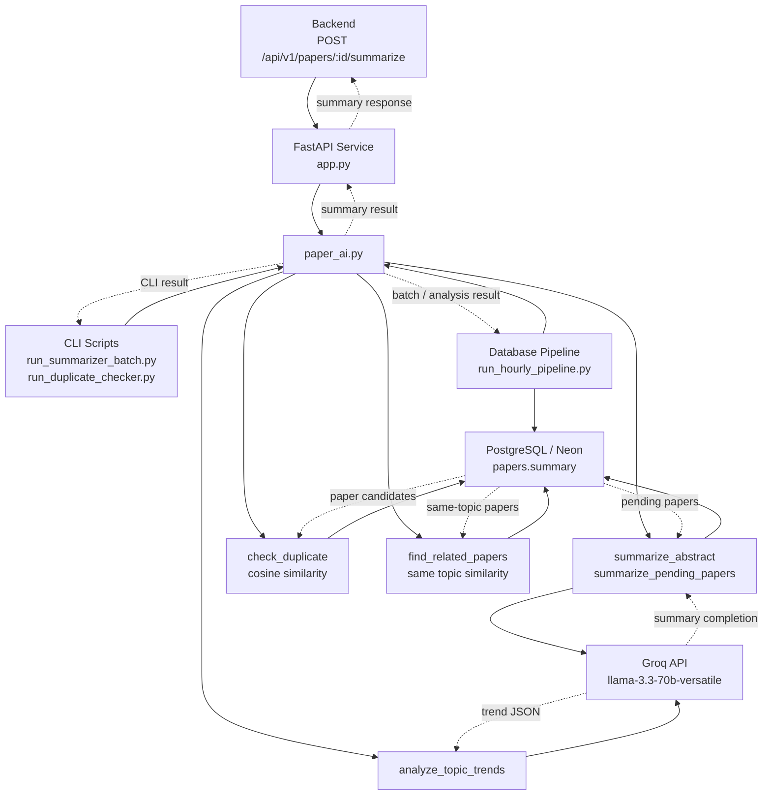
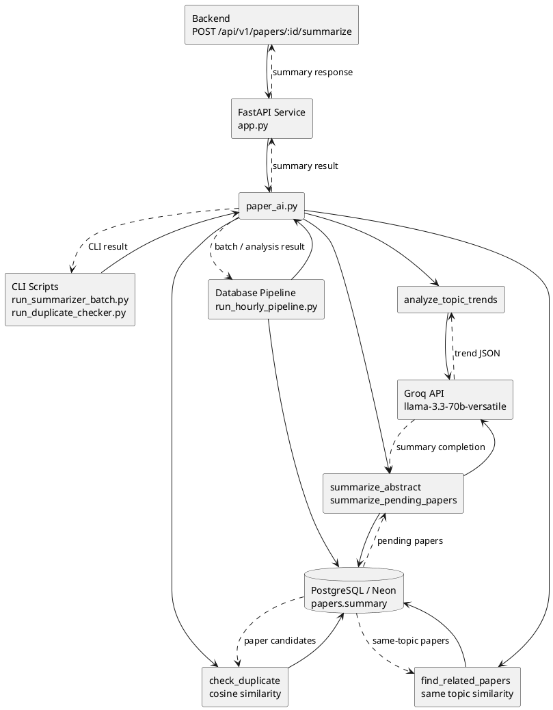

# AI Service - Web Paper Tracker System

Người phụ trách: Nguyễn Trọng Phúc

---

## 1. Chức Năng Chính

| Chức năng | Mô tả |
| --- | --- |
| Summary một abstract | Gọi Groq AI để tóm tắt abstract thành 3-4 câu tiếng Anh ngắn gọn |
| Batch summary | Lấy paper có `summary IS NULL`, tóm tắt và lưu vào `papers.summary` |
| Summary API service | FastAPI endpoint `POST /summarize` để Backend gọi khi cần tóm tắt on-demand |
| Duplicate checker | So sánh `title + abstract` bằng cosine similarity, không gọi Groq |
| Related paper finder | Tìm paper cùng `topic_id` có similarity vừa phải để pipeline lưu vào `related_papers` |
| Topic trend analyzer | Dùng Groq AI rank danh sách topic theo xu hướng |
| Script hỗ trợ | Có script batch summary và script test duplicate checker từ command line |
| Router optional/legacy | `router.py` là code optional/legacy, không phải luồng chính hiện tại |

---

## 2. Cấu Trúc File Hiện Tại

```txt
ai/
|-- .env                         # Chứa GROQ_API_KEY, không commit
|-- .gitignore                   # Ignore .env, .venv, __pycache__
|-- README.md                    # Tài liệu module AI
|-- requirements.txt             # Thư viện Python cho AI service/scripts
|-- app.py                       # FastAPI app chính: /summarize va /trends
|-- paper_ai.py                  # Summary, duplicate checker, related finder, trend analyzer
|-- run_summarizer_batch.py      # Script tóm tắt batch paper chưa có summary
|-- run_duplicate_checker.py     # Script test duplicate/near-duplicate từ command line
|-- router.py                    # Optional/legacy router, không dùng trong luồng chính
```

Ghi chú:

- `.venv/` va `__pycache__/` là file/folder local, không commit.
- `router.py` hiện có các import legacy như `auth.service`, `papers.schemas`; không chạy trực tiếp bằng `uvicorn router:app`.

---

## 3. Kiến Trúc

### 3.1. Sơ Đồ Kiến Trúc Tổng Thể



#### 3.1.1. Sơ Đồ Kiến Trúc Tổng Thể - PlantUML



### 3.2. Luồng Summary Batch

Luồng batch precompute giúp tránh việc FE/BE gọi AI hàng loạt.

```txt
Crawler thêm paper mới vào DB
        |
        v
papers.summary đang NULL
        |
        v
Chạy ai/run_summarizer_batch.py
        |
        v
summarize_pending_papers(db, batch_size=20)
        |
        v
summarize_abstract(abstract) gọi Groq AI
        |
        v
Lưu kết quả vào papers.summary
        |
        v
Backend trả summary qua GET /api/v1/papers va GET /api/v1/papers/:id
```

### 3.3. Luồng Summary On-Demand

Dùng khi user mở trang chi tiết paper mà `summary` vẫn đang `NULL`.

```txt
FE gọi GET /api/v1/papers/:id
        |
        v
Nếu summary = NULL, FE gọi POST /api/v1/papers/:id/summarize
        |
        v
Backend gọi AI service POST /summarize
        |
        v
summarize_abstract(abstract) gọi Groq AI
        |
        v
Backend lưu summary vào papers.summary
        |
        v
Backend trả summary cho FE
```

### 3.4. Luồng Duplicate Checker

Duplicate checker không gọi Groq AI. Logic nằm trong `paper_ai.py`.

```txt
Input paper
(title + abstract)
        |
        v
check_duplicate(db, title, abstract)
        |
        v
Lấy paper hiện có trong DB
        |
        v
Tạo word frequency
        |
        v
Tính cosine similarity
        |
        v
Lọc paper có similarity >= threshold
        |
        v
Trả is_duplicate, match_count, highest_similarity, matches[]
```

Kết quả duplicate được Database pipeline lưu vào `matching_papers`. Backend đọc bảng này qua:

```txt
GET /api/v1/papers/:id/matches?limit=5
```

### 3.5. Luồng Related Papers

Related finder không gọi Groq AI. Logic nằm trong `paper_ai.py`.

```txt
Paper cần xử lý
        |
        v
find_related_papers(db, paper_id)
        |
        v
Lấy paper cùng topic_id
        |
        v
So sánh title + abstract bằng cosine similarity
        |
        v
Lọc related_threshold <= similarity < duplicate_threshold
        |
        v
Pipeline lưu vào related_papers
        |
        v
Backend trả GET /api/v1/papers/:id/related
```

Mặc định trong Database pipeline:

```txt
related_threshold   = 0.20
duplicate_threshold = 0.50
related_limit       = 5
```

### 3.6. Luồng Topic Trends

Topic trend analyzer dùng Groq AI để sắp xếp topic theo xu hướng.

```txt
Database pipeline lấy danh sách topic từ DB
        |
        v
analyze_topic_trends(topic_titles)
        |
        v
Groq AI rank topic
        |
        v
Pipeline lưu điểm rank vào topics.trending
        |
        v
Backend trả GET /api/v1/stats/topics/trends
```

Nếu Groq lỗi hoặc pipeline chạy với `--skip-ai-trends`, Database pipeline fallback sang cách đếm paper gần đây.

---

## 4. Setup Môi Trường

### 4.1. Yêu Cầu

- Python 3.11 khuyến nghị.
- `database/.env` có `DATABASE_URL` nếu dùng batch summary, duplicate checker, related finder.
- `ai/.env` có `GROQ_API_KEY` nếu dùng summary hoặc AI topic trend.

Ghi chú:

- Duplicate checker và related finder chỉ cần DB, không cần `GROQ_API_KEY`.
- Summary và AI topic trend cần `GROQ_API_KEY`.

### 4.2. Tạo File `.env`

Tạo file:

```txt
ai/.env
```

Nội dung:

```env
GROQ_API_KEY=gsk_...
```

Không commit file `.env`.

### 4.3. Tạo Virtual Environment

Chạy từ thư mục `ai/`:

```powershell
py -3.11 -m venv .venv
.\.venv\Scripts\activate
python --version
pip install -r requirements.txt
```

Kết quả `python --version` nên là Python 3.11.x.

Nếu đã có `.venv` và mới pull code:

```powershell
pip install -r requirements.txt
```

### 4.4. Lỗi Thường Gặp

Neu go `uvicorn` bị lỗi không nhận command:

```txt
uvicorn : The term 'uvicorn' is not recognized
```

Dùng lệnh này thay thế:

```powershell
python -m uvicorn app:app --host 0.0.0.0 --port 8001 --reload
```

Nếu cài thư viện bị lỗi với Python 3.13, tạo lại venv bằng Python 3.11:

```powershell
deactivate
py -3.11 -m venv .venv
.\.venv\Scripts\activate
python --version
pip install -r requirements.txt
```

---

## 5. Hướng Dẫn Sử Dụng Summary

### 5.1. Chạy Batch Summary Bằng Script

Chạy từ thư mục `ai/`:

```powershell
python run_summarizer_batch.py --batch-size 20
```

Ý nghĩa:

- Lấy tối đa 20 paper co `summary IS NULL`.
- Gọi Groq AI để tóm tắt abstract.
- Lưu kết quả vào `papers.summary`.
- In số paper tóm tắt thành công.

Output mẫu:

```txt
[AI] Đã tóm tắt: Transformer for Stock Prediction...
[AI] Đã tóm tắt: Recent Advances in AI Agents...
[AI] Summarized 20 pending papers.
```

Chạy ít hơn để test:

```powershell
python run_summarizer_batch.py --batch-size 3
```

Output mẫu:

```txt
[AI] Đã tóm tắt: Transformer for Stock Prediction...
[AI] Summarized 3 pending papers.
```

### 5.2. Chạy FastAPI Summary Service Cho Backend

Chạy từ thư mục `ai/`:

```powershell
python -m uvicorn app:app --host 0.0.0.0 --port 8001 --reload
```

Service chạy tại:

```txt
http://localhost:8001
```

Backend gọi service nay qua bien:

```env
AI_SERVICE_URL=http://localhost:8001
```

Test endpoint:

```http
POST http://localhost:8001/summarize
Content-Type: application/json

{
  "abstract": "This paper proposes a transformer-based method for paper recommendation."
}
```

Response mau:

```json
{
  "success": true,
  "message": "Summarize successfully",
  "data": {
    "summary": "The paper addresses paper recommendation by using a transformer-based method. It learns semantic representations from abstracts to improve matching between users and relevant papers. The approach shows potential for improving recommendation quality compared with simpler keyword-based methods."
  }
}
```

Response loi mau:

```json
{
  "detail": "Abstract is required"
}
```

### 5.3. Gọi Function Tóm Tắt Một Abstract

```python
from paper_ai import summarize_abstract

abstract = "We propose a novel transformer-based method..."
summary = summarize_abstract(abstract)
print(summary)
```

Response mau:

```txt
The paper proposes a transformer-based method to solve a prediction task. The main method uses attention mechanisms to learn relationships in the input data. The results suggest that the model can improve accuracy compared with traditional approaches.
```

### 5.4. Gọi Function Tóm Tắt Nhiều Paper

Nếu chạy từ thư mục gốc project, dùng mẫu sau:

```python
from pathlib import Path
import sys

from dotenv import load_dotenv

ROOT_DIR = Path(__file__).resolve().parent

sys.path.insert(0, str(ROOT_DIR / "database"))
sys.path.insert(0, str(ROOT_DIR / "ai"))

load_dotenv(ROOT_DIR / "database" / ".env")
load_dotenv(ROOT_DIR / "ai" / ".env")

from database import SessionLocal
from paper_ai import summarize_pending_papers

db = SessionLocal()

try:
    count = summarize_pending_papers(db, batch_size=20)
    print(f"Đã tóm tắt {count} papers")
finally:
    db.close()
```

Output mẫu:

```txt
[AI] Đã tóm tắt: Transformer for Stock Prediction...
[AI] Đã tóm tắt: Recent Advances in AI Agents...
Đã tóm tắt 20 papers
```

---

## 6. Hướng Dẫn Sử Dụng Duplicate Checker

### 6.1. Chạy Duplicate Checker Bằng Script Theo Paper ID

Chạy từ thư mục `ai/`:

```powershell
python run_duplicate_checker.py --paper-id 1 --exclude-self --threshold 0.5 --limit 10
```

Ý nghĩa:

- `--paper-id 1`: lấy `title` và `abstract` của paper id 1 làm input.
- `--exclude-self`: bỏ qua chính paper id 1 khi so sanh.
- `--threshold 0.5`: ngưỡng giống nhau tối thiểu, từ 0 đến 1.
- `--limit 10`: trả tối đa 10 paper trùng/gần giống.

Response mẫu khi có paper gần giống:

```json
{
  "input": {
    "paper_id": 1,
    "title": "Transformer for Stock Prediction",
    "threshold": 0.5,
    "limit": 10,
    "exclude_paper_id": 1
  },
  "result": {
    "is_duplicate": true,
    "match_count": 2,
    "highest_similarity": 82.15,
    "matches": [
      {
        "id": 5,
        "title": "Deep Learning for Stock Prediction",
        "pdf_url": "https://arxiv.org/pdf/2401.00005",
        "similarity": 82.15,
        "status": "Gần giống"
      }
    ]
  }
}
```

### 6.2. Chạy Duplicate Checker Bằng Title Và Abstract Tự Nhập

```powershell
python run_duplicate_checker.py --title "Transformer for natural language processing" --abstract "This paper studies transformer models for language understanding." --threshold 0.5 --limit 5
```

Response mẫu khi không trùng:

```json
{
  "input": {
    "paper_id": null,
    "title": "Transformer for natural language processing",
    "threshold": 0.5,
    "limit": 5,
    "exclude_paper_id": null
  },
  "result": {
    "is_duplicate": false,
    "match_count": 0,
    "highest_similarity": 31.44,
    "matches": []
  }
}
```

### 6.3. Gọi Function Duplicate Checker Trực Tiếp

```python
from paper_ai import check_duplicate

result = check_duplicate(
    db,
    new_paper_title="Transformer for Stock Prediction",
    new_paper_abstract="We propose a transformer-based method...",
    threshold=0.50,
    exclude_paper_id=None,
    limit=5,
)

print(result)
```

Response mau:

```python
{
    "is_duplicate": True,
    "match_count": 2,
    "highest_similarity": 91.29,
    "matches": [
        {
            "id": 2,
            "title": "Transformer Stock Prediction Using Deep Learning",
            "pdf_url": "https://arxiv.org/pdf/2401.00002",
            "similarity": 91.29,
            "status": "Trùng hoàn toàn"
        }
    ]
}
```

---

## 7. Hướng Dẫn Sử Dụng Related Papers

### 7.1. Gọi Function Tìm Paper Liên Quan

```python
from paper_ai import find_related_papers

result = find_related_papers(
    db,
    paper_id=1,
    threshold=0.20,
    upper_threshold=0.50,
    limit=5,
)

print(result)
```

Response mau:

```python
{
    "paper_id": 1,
    "related_count": 2,
    "highest_similarity": 44.21,
    "related_papers": [
        {
            "id": 7,
            "title": "Representation Learning for Paper Recommendation",
            "pdf_url": "https://arxiv.org/pdf/2401.00007",
            "topic_id": 1,
            "similarity": 44.21
        }
    ]
}
```

### 7.2. Cách Lấy Kết Quả Ở Backend

Database pipeline lưu related papers vào bảng `related_papers`. Backend trả cho FE qua:

```http
GET /api/v1/papers/1/related?limit=5
```

Response Backend mau:

```json
{
  "success": true,
  "message": "Get related papers successfully",
  "data": {
    "paper_id": 1,
    "source": "related_papers",
    "related_papers": [
      {
        "id": 7,
        "title": "Representation Learning for Paper Recommendation",
        "abstract": "This paper studies...",
        "summary": null,
        "authors": ["Author A"],
        "published_date": "2026-05-14T00:00:00.000Z",
        "created_at": "2026-05-14T00:00:00.000Z",
        "pdf_url": "https://arxiv.org/pdf/2401.00007",
        "avg_rating": 0,
        "topic_id": 1,
        "is_read": false,
        "is_new": false
      }
    ]
  }
}
```

---

## 8. Hướng Dẫn Sử Dụng Topic Trends

### 8.1. Gọi FastAPI Endpoint `/trends`

```http
POST http://localhost:8001/trends
Content-Type: application/json

{
  "topic_titles": [
    "Machine Learning",
    "Natural Language Processing",
    "Computer Vision"
  ]
}
```

Response mau:

```json
{
  "success": true,
  "message": "Analyze trends successfully",
  "data": {
    "ranked_topics": [
      "Machine Learning",
      "Natural Language Processing",
      "Computer Vision"
    ],
    "analysis": "Machine Learning remains highly active due to foundation models and applied AI systems.",
    "trending_keywords": ["LLM", "agents", "multimodal"],
    "source": "ai"
  }
}
```

### 8.2. Gọi Function Trực Tiếp

```python
from paper_ai import analyze_topic_trends

result = analyze_topic_trends([
    "Machine Learning",
    "Natural Language Processing",
    "Computer Vision",
])

print(result)
```

Response fallback mau khi Groq loi:

```python
{
    "ranked_topics": [
        "Machine Learning",
        "Natural Language Processing",
        "Computer Vision"
    ],
    "analysis": "Không thể phân tích xu hướng",
    "trending_keywords": [],
    "source": "fallback"
}
```

---

## 9. API Endpoints

### 9.1. Endpoint Chinh

| Method | Endpoint | Dùng cho | Ghi chú |
| --- | --- | --- | --- |
| POST | `/summarize` | Backend Node.js | Tóm tắt on-demand cho một abstract |
| POST | `/trends` | Database pipeline/dev | Rank topic bằng Groq AI |

Frontend không gọi AI service trực tiếp. Frontend nên gọi Backend Node.js.

### 9.2. Chạy AI Service

```powershell
cd ai
.\.venv\Scripts\activate
python -m uvicorn app:app --host 0.0.0.0 --port 8001 --reload
```

URL:

```txt
http://localhost:8001
```

### 9.3. Router Optional/Legacy

`ai/router.py` chỉ là router optional/legacy, không phải luồng chính. File nay phụ thuộc các import chưa được wire trong folder `ai/`:

```txt
database.get_db
auth.service.get_current_user
papers.schemas.PaperList
papers.schemas.PaperOut
```

Không chạy trực tiếp bằng:

```powershell
python -m uvicorn router:app --reload
```

---

## 10. Kết Hợp Với Database Pipeline

Database pipeline có thể gọi các function trong `ai/paper_ai.py`:

```txt
database/run_hourly_pipeline.py
        |
        v
Crawler arXiv hoặc --skip-crawler
        |
        v
Chọn paper cần xử lý
        |
        v
find_related_papers()
        |
        v
check_duplicate()
        |
        v
summarize_pending_papers()
        |
        v
analyze_topic_trends()
```

Command pipeline hay dùng:

```powershell
cd database
python run_hourly_pipeline.py --run-once
```

Chỉ xử lý related/duplicate/trend/summary trên paper đã có, không crawl arXiv:

```powershell
python run_hourly_pipeline.py --run-once --skip-crawler
```

Bỏ qua summary để test nhanh:

```powershell
python run_hourly_pipeline.py --run-once --skip-summary
```

Bỏ qua AI trend, dùng fallback đếm paper gần đây:

```powershell
python run_hourly_pipeline.py --run-once --skip-ai-trends
```

---

## 11. Thuật Toán Duplicate Và Related

### 11.1. Ý Tưởng

Duplicate checker va related finder đều dùng cosine similarity trên text:

```txt
title + abstract
```

Text được tách thành word frequency:

```txt
"transformer stock prediction" -> {"transformer": 1, "stock": 1, "prediction": 1}
```

### 11.2. Công Thức

```txt
similarity = dot_product(A, B) / (|A| * |B|)
```

### 11.3. Phân Loại Duplicate

```txt
>= 90%      -> Trùng hoàn toàn
50% - 90%  -> Gần giống
< 50%      -> Không xem là duplicate theo mặc định pipeline
```

### 11.4. Phân Loại Related

```txt
20% - <50% -> Related paper
>= 50%     -> Duplicate/near-duplicate, không lưu vào related_papers
```

Lý do duplicate/related không dùng Groq:

- Chạy nhanh hơn.
- Không tốn token.
- Dễ chạy batch trong pipeline.
- Dễ debug vì có similarity score.

---

## 12. Model AI Sử Dụng

| Thông tin | Chi tiết |
| --- | --- |
| Dịch vụ | Groq |
| Model | `llama-3.3-70b-versatile` |
| Summary output | English summary, 3-4 câu ngắn gọn |
| Trend output | JSON gồm `ranked_topics`, `analysis`, `trending_keywords` |

---

## 13. Liên Kết

- Groq Console: `https://console.groq.com`
- Groq Models: `https://console.groq.com/docs/models`
- arXiv API: `https://arxiv.org/help/api`
