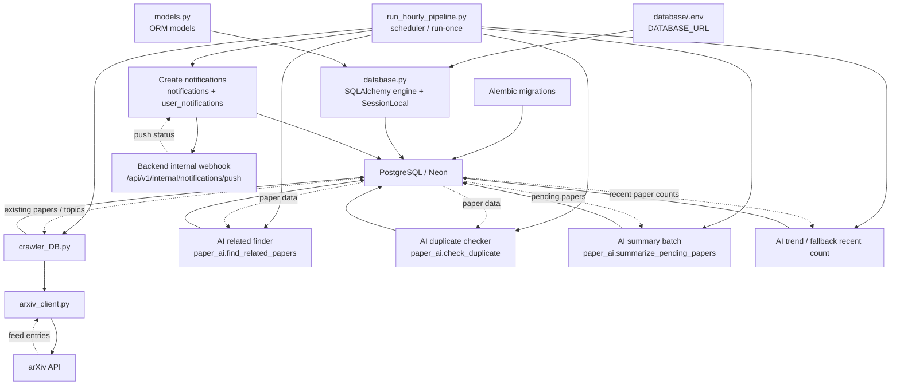
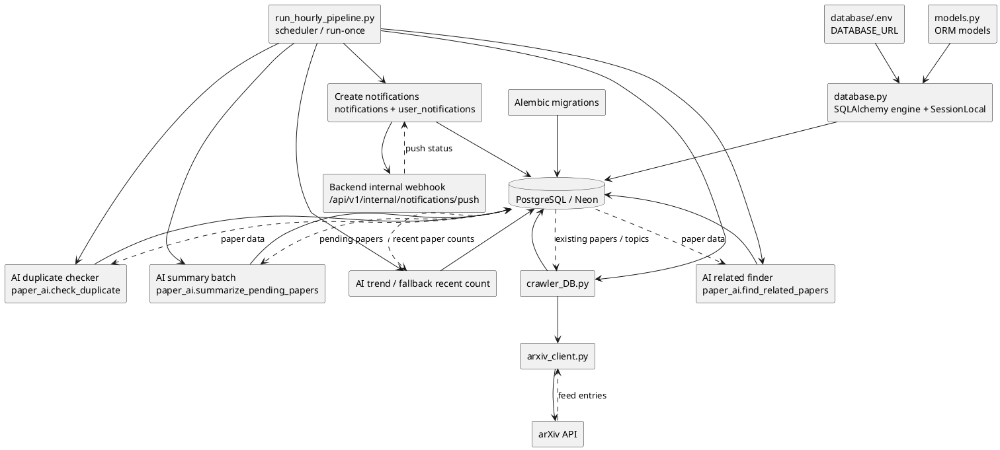

# Database Module - PostgreSQL + SQLAlchemy + Alembic

Thư mục `database/` quản lý phần database của Web Paper Tracker System:

- Kết nối PostgreSQL/Neon.
- Định nghĩa SQLAlchemy models.
- Quản lý migration bằng Alembic.
- Seed dữ liệu user mẫu.
- Crawl paper từ arXiv và lưu vào DB.
- Chạy pipeline theo giờ để crawl, tạo notification, tìm paper liên quan, check trùng, summarize, cập nhật rating average và topic trends.

---

## 1. Chức Năng Chính

| Chức năng | Mô tả |
| --- | --- |
| Database connection | Đọc `DATABASE_URL` từ `database/.env` và tạo SQLAlchemy session |
| Models | Định nghĩa bảng core và advanced: `users`, `topics`, `papers`, `favorites`, `user_topics`, `related_papers`, `matching_papers`, `user_paper_interactions`, `notifications`, `user_notifications` |
| Migration | Dùng Alembic để tạo/cập nhật schema |
| Seed data | Tạo user mẫu phục vụ test Backend/Frontend |
| arXiv crawler | Lấy X paper mới nhất trong 10 topic mặc định từ arXiv API, tự gán topic và tạo topic mới nếu cần |
| Hourly pipeline | Chạy crawler theo giờ, tạo notification gộp theo topic, tìm paper liên quan, check trùng, gọi AI summary, cập nhật rating average và topic trends |

Ghi chú:

- Backend Node.js chỉ query database, không tự migrate schema.
- Schema/migration thuộc trách nhiệm của thư mục `database/`.
- AI summary và AI topic trend dùng thêm file `ai/.env` để lấy `GROQ_API_KEY`.

---

## 2. Cấu Trúc File Hiện Tại

```txt
database/
|-- .env                         # DATABASE_URL, không commit
|-- .env.example                 # Mẫu cấu hình DATABASE_URL và BE notification webhook
|-- .gitignore                   # Ignore .env, .venv, __pycache__
|-- README.md                    # Tài liệu module database
|-- requirements.txt             # Thư viện Python cho database/crawler/pipeline
|-- database.py                  # Engine, SessionLocal, Base
|-- models.py                    # SQLAlchemy models
|-- seed_data.py                 # Seed user mẫu
|-- run_hourly_pipeline.py       # Scheduler crawl + notification + related + duplicate check + summary + topic trends
|-- alembic.ini                  # Config Alembic
|-- alembic/
|   |-- env.py                   # Alembic environment
|   |-- script.py.mako
|   |-- versions/
|       |-- b013cd206c13_...py   # Migration khởi tạo bảng chính
|       |-- d39714405368_...py   # Migration thêm topic_id vào papers
|       |-- b813dd37eebb_...py   # Migration thêm related/matching/notifications/interactions/trending
|       |-- e192a41f90eb_...py   # Migration thêm avg_rating vào papers
|-- crawler/
    |-- arxiv_client.py          # Gọi arXiv API, chưa ghi DB
    |-- crawler_DB.py            # Gọi arXiv client và lưu paper vào DB
```

Các thư mục sinh ra khi chạy local:

```txt
database/.venv/
database/__pycache__/
*.pyc
```

Các file/thư mục này không cần commit.

---

## 3. Kiến Trúc

### 3.1. Sơ Đồ Kiến Trúc Tổng Thể



#### 3.1.1. Sơ Đồ Kiến Trúc Tổng Thể - PlantUML



### 3.2. Database Connection

File chính:

```txt
database/database.py
```

Luồng kết nối:

```txt
database/.env
        |
        v
DATABASE_URL
        |
        v
create_engine(DATABASE_URL)
        |
        v
SessionLocal()
        |
        v
Repository / crawler / AI script query database
```

### 3.3. Database Schema

File chính:

```txt
database/models.py
```

Các bảng/cột core hiện có:

```txt
users
topics
papers
favorites
user_topics
alembic_version
```

Các bảng/cột advanced đã có trong `models.py` và migration:

```txt
related_papers
matching_papers
user_paper_interactions
notifications
user_notifications
topics.trending
papers.avg_rating
```

Quan hệ chính:

- Một `Topic` có nhiều `Paper` qua `papers.topic_id`.
- Một `User` có thể follow nhiều `Topic` qua `user_topics`.
- Một `User` có thể favorite nhiều `Paper` qua `favorites`.
- `favorites` và `user_topics` dùng composite primary key.
- `related_papers` lưu quan hệ paper liên quan.
- `matching_papers` lưu quan hệ paper trùng/gần giống.
- `user_paper_interactions` lưu trạng thái đọc, rating và notes của user với paper.
- `notifications` lưu nội dung thông báo; `user_notifications` phân phối thông báo cho từng user và lưu trạng thái đã đọc.

### 3.4. Migration Flow

```txt
models.py
        |
        v
alembic revision
        |
        v
alembic/versions/*.py
        |
        v
alembic upgrade head
        |
        v
PostgreSQL/Neon schema được cập nhật
```

### 3.5. arXiv Crawler Flow

```txt
crawler/arxiv_client.py
        |
        v
Gọi arXiv API lấy X paper mới nhất
        |
        v
Gán topic theo primary_category của arXiv
        |
        v
Tạo topic mới nếu topic chưa có trong DB
        |
        v
Trả về list paper dạng dict
        |
        v
crawler/crawler_DB.py
        |
        v
Check trùng bằng arxiv_id
        |
        v
Insert paper mới vào bảng papers
```

### 3.6. Hourly Pipeline Flow

File chính:

```txt
database/run_hourly_pipeline.py
```

Luồng xử lý:

```txt
Scheduler theo giờ
        |
        v
run_crawler()
        |
        v
Insert paper mới vào DB
        |
        v
create_new_paper_notifications()
        |
        v
notify_backend_new_notifications()
        |
        v
find_related_papers() từ ai/paper_ai.py
        |
        v
check_duplicate() từ ai/paper_ai.py
        |
        v
summarize_pending_papers() từ ai/paper_ai.py
        |
        v
Lưu summary vào papers.summary
        |
        v
update_topic_trends()
        |
        v
Gọi analyze_topic_trends() để rank topic bằng AI
        |
        v
Cập nhật topics.trending theo thứ hạng AI
```

`create_new_paper_notifications()` gom các paper mới theo `topic_id`, tạo một notification cho mỗi topic và phân phối cho các user đang follow topic đó qua `user_notifications`. Nếu pipeline được trigger thủ công từ Backend bằng `--trigger-user-id`, user vừa bấm nút tải lại cũng được nhận notification trong chuông, kể cả khi chưa follow topic đó.

`notify_backend_new_notifications()` gọi Backend internal webhook `POST /api/v1/internal/notifications/push` với danh sách `notification_ids` vừa tạo. Backend dùng tín hiệu này để đẩy notification realtime xuống FE qua SSE.

Duplicate checker chạy trong pipeline và lưu các cặp trùng/gần giống vào bảng `matching_papers`. Nếu crawler có paper mới, pipeline chỉ check nhóm paper mới. Nếu không có paper mới hoặc chạy với `--skip-crawler`, pipeline tự lấy các paper đang có trong DB để check. Backend đọc bảng này qua `GET /api/v1/papers/:id/matches`.

Related finder chạy trong pipeline và lưu các cặp paper liên quan vào bảng `related_papers`. Nếu crawler có paper mới, pipeline chỉ xử lý nhóm paper mới. Nếu không có paper mới hoặc chạy với `--skip-crawler`, pipeline tự lấy các paper đang có trong DB để xử lý. Pipeline lấy paper cùng `topic_id`, so sánh `title + abstract` bằng cosine similarity, lọc các paper có similarity từ `--related-threshold` đến dưới `--duplicate-threshold`, rồi lưu top N vào bảng `related_papers`. Backend đọc bảng này qua `GET /api/v1/papers/:id/related` và vẫn fallback cùng topic nếu bảng chưa có dữ liệu.

`update_topic_trends()` ưu tiên gọi `analyze_topic_trends()` trong `ai/paper_ai.py` để rank topic bằng Groq AI, sau đó lưu điểm vào `topics.trending`. Nếu AI lỗi hoặc chạy với `--skip-ai-trends`, pipeline fallback sang cách đếm số paper gần đây của từng topic. Backend đọc cột này qua `GET /api/v1/stats/topics/trends`.

---

## 4. Setup Môi Trường

### 4.1. Yêu Cầu

- Python 3.11 khuyến nghị.
- PostgreSQL/Neon database.
- `database/.env` có `DATABASE_URL`.
- `ai/.env` có `GROQ_API_KEY` nếu chạy bước summary hoặc AI topic trend.

### 4.2. Cấu Hình Database URL

Tạo file:

```txt
database/.env
```

Nội dung:

```env
DATABASE_URL=postgresql://<username>:<password>@<host>/<dbname>?sslmode=require

# Optional: bật realtime notification DB pipeline -> BE -> FE
BACKEND_NOTIFICATION_PUSH_URL=http://localhost:8000/api/v1/internal/notifications/push
BACKEND_INTERNAL_SECRET=change_me
```

Không commit file `.env`.

### 4.3. Cấu Hình AI Key Cho Pipeline

Nếu chạy pipeline có bước summary, cần thêm:

```txt
ai/.env
```

Nội dung:

```env
GROQ_API_KEY=gsk_...
```

Nếu chỉ test crawler, có thể dùng `--skip-summary --skip-ai-trends` để không cần gọi Groq.

### 4.4. Tạo Virtual Environment `.venv`

Chạy từ thư mục `database/`:

```powershell
cd database
py -3.11 -m venv .venv
.\.venv\Scripts\activate
python --version
pip install -r requirements.txt
```

Kết quả `python --version` nên là Python 3.11.x.

Nếu đã có `.venv`, sau khi pull code mới nên chạy lại:

```powershell
pip install -r requirements.txt
```

---

## 5. Hướng Dẫn Sử Dụng

### 5.1. Hướng Dẫn Cho User Chạy Server

Phần này dành cho trường hợp môi trường đã được setup sẵn:

- Đã có `database/.env`.
- Đã có `ai/.env` nếu chạy summary.
- Đã cài package trong `.venv`.
- DB đã được migration sẵn.

User chỉ cần activate môi trường và chạy crawler/pipeline.

### 5.1.1. Activate Môi Trường

Chạy từ thư mục `database/`:

```powershell
cd database
.\.venv\Scripts\activate
```

Nếu chưa chắc đang dùng đúng Python:

```powershell
python --version
```

### 5.1.2. Chạy Pipeline

Đây là luồng chính nên dùng khi môi trường đã setup sẵn.

### 5.1.2.1. Chạy Pipeline Không Option

Chạy:

```powershell
python run_hourly_pipeline.py
```

Ý nghĩa:

- Đây là cách chạy scheduler mặc định của DB pipeline.
- Pipeline chạy một lần ngay khi start.
- Sau đó pipeline tự chạy lại mỗi 1 giờ.
- Nếu job cũ chưa xong, scheduler không cho job mới chạy chồng lên.

Mỗi lần pipeline chạy sẽ làm:

```txt
crawl X paper mới nhất từ arXiv
-> tự gán topic theo primary_category của arXiv
-> tạo topic mới nếu topic chưa có trong DB
-> insert paper mới
-> tạo notification gộp theo topic
-> gọi BE internal webhook nếu có notification mới
-> nếu có paper mới thì xử lý related/duplicate cho paper mới
-> nếu không có paper mới thì xử lý related/duplicate cho paper đã có trong DB
-> lưu kết quả vào related_papers và matching_papers
-> summarize paper chưa có summary
-> phân tích topic trend bằng AI và cập nhật topics.trending
```

### 5.1.2.2. Các CMD Khác Thường Dùng

Chạy pipeline một lần rồi thoát:

```powershell
python run_hourly_pipeline.py --run-once
```

Ý nghĩa: dùng khi muốn test nhanh toàn bộ pipeline, chạy xong thì terminal kết thúc.

Test pipeline nhanh với số paper ít:

```powershell
python run_hourly_pipeline.py --run-once --crawler-max-results 2 --crawler-sleep-seconds 0 --summary-batch-size 5
```

Ý nghĩa: lấy tối đa 2 paper mới nhất, không chờ giữa các lượt crawler, summary tối đa 5 paper.

Test crawler không gọi summary và không gọi AI trend:

```powershell
python run_hourly_pipeline.py --run-once --crawler-max-results 15 --crawler-sleep-seconds 0 --skip-summary --skip-ai-trends
```

Ý nghĩa: dùng khi chỉ muốn kiểm tra crawler và ghi DB, tránh tốn quota Groq.

Cào thủ công một topic theo `topic_id`, mỗi lần lấy tối đa 5 paper:

```powershell
python run_hourly_pipeline.py --run-once --topic-id 1 --crawler-max-results 5 --skip-summary --skip-ai-trends
```

Ý nghĩa: chỉ refresh paper cho một topic cụ thể trong bảng `topics`.

Chạy pipeline không cào arXiv nhưng vẫn chạy related, duplicate, summary, rating và trend trên dữ liệu hiện có:

```powershell
python run_hourly_pipeline.py --run-once --skip-crawler
```

Ý nghĩa: dùng khi muốn xử lý dữ liệu đã có trong DB, không gọi arXiv.

Nếu chỉ muốn maintenance related/duplicate mà không gọi summary/trend:

```powershell
python run_hourly_pipeline.py --run-once --skip-crawler --skip-summary --skip-trends
```

Ý nghĩa: dùng để backfill hoặc cập nhật `related_papers`/`matching_papers` nhanh trên dữ liệu hiện có.

Chạy scheduler mỗi 1 giờ:

```powershell
python run_hourly_pipeline.py --interval-hours 1
```

Ý nghĩa: tương đương chạy scheduler mặc định, nhưng ghi rõ interval là 1 giờ.

Chạy scheduler nhưng không chạy ngay lần đầu:

```powershell
python run_hourly_pipeline.py --interval-hours 1 --no-run-immediately
```

Ý nghĩa: chỉ bật lịch chạy, đợi đến lượt kế tiếp mới chạy pipeline.

Output mẫu:

```txt
[PIPELINE] Bat dau pipeline: crawler + notification + related + kiem tra trung + summary.
Bat dau crawler arXiv.
Da lay 15 paper tu arXiv.
Topic 'Machine Learning': da lay=4, da them=1, bo qua do da ton tai=3.
Topic 'Computer Vision': da lay=3, da them=1, bo qua do da ton tai=2.
Saved 2 new papers.
[PIPELINE] Paper 15 co 3 paper lien quan.
[PIPELINE] Da luu 3 cap paper lien quan vao related_papers.
[PIPELINE] Paper 15 co 1 paper trung hoac gan giong.
[PIPELINE] Da luu 1 cap paper trung hoac gan giong vao matching_papers.
[AI] Summarized 5 pending papers.
[PIPELINE] Da cap nhat diem trung binh cho 3 paper.
[PIPELINE] AI trend analysis: Machine Learning and NLP are currently strong trends...
[PIPELINE] Da cap nhat xu huong cho 11 topic bang ai.
[PIPELINE] Hoan thanh. Da lay: 15, da them: 2, bo qua do da ton tai: 13, thong bao: 1, luu related: 3, kiem tra trung: 2, luu match: 1, da summary: 5, cap nhat rating: 3, cap nhat trend topic: 11.
```

### 5.1.2.3. Các Tham Số Quan Trọng Của Pipeline

```txt
--run-once                 Chạy một lần rồi thoát
--interval-hours 1         Khoảng cách giữa các lần chạy
--crawler-max-results 5    Số paper mới nhất tối đa cần lấy; nếu có --topic-id thì lấy riêng topic đó
--crawler-sleep-seconds 10 Nghỉ giữa các topic để tránh arXiv rate limit
--topic-id 1               Chỉ cào một topic theo id trong bảng topics
--summary-batch-size 20    Số paper tối đa được tóm tắt mỗi lần chạy
--related-threshold 0.20   Ngưỡng tối thiểu để xem là paper liên quan
--related-limit 5          Số paper liên quan tối đa lưu cho mỗi paper được xử lý
--duplicate-threshold 0.50 Ngưỡng nhận diện trùng/gần giống
--duplicate-limit 5        Số paper match tối đa trả về cho mỗi paper được xử lý
--trend-recent-days 7      Số ngày gần nhất dùng khi fallback tính topics.trending
--skip-ai-trends           Không gọi Groq AI để rank topic, dùng fallback đếm paper gần đây
--skip-crawler             Chỉ bỏ bước crawl arXiv; các bước còn lại vẫn chạy
--skip-trends              Bỏ qua bước cập nhật topics.trending
--skip-summary             Bỏ qua bước summary, dùng khi chỉ muốn test crawler
```

Ghi chú crawler mới:

- Nếu không truyền `--topic-id`, crawler lấy `--crawler-max-results` paper mới nhất trong 10 topic mặc định.
- Topic được gán bằng keyword/title/abstract trước, rồi fallback theo `primary_category` của arXiv.
- Có thể thêm topic nhanh bằng cách thêm một dòng vào `DEFAULT_TOPIC_QUERIES` trong `database/crawler/arxiv_client.py`.
- Có thể override toàn bộ query latest bằng biến môi trường `ARXIV_LATEST_QUERY` trong `database/.env`.

Ví dụ chạy mỗi 2 giờ, mỗi lần lấy 5 paper mới nhất, tóm tắt tối đa 10 paper, lưu tối đa 5 paper liên quan, dùng AI rank topic trend và dùng 7 ngày gần nhất làm fallback:

```powershell
python run_hourly_pipeline.py --interval-hours 2 --crawler-max-results 5 --crawler-sleep-seconds 10 --summary-batch-size 10 --related-threshold 0.20 --related-limit 5 --trend-recent-days 7
```

### 5.1.3. Test arXiv API Không Ghi DB - For Testing

Chạy:

```powershell
python crawler\arxiv_client.py
```

Lệnh này chỉ gọi arXiv API và in thử paper ra terminal.

Nó không insert dữ liệu vào DB.

Output mẫu:

```txt
[Bài 1] ID: 2605.xxxxxv1
Tiêu đề: ...
Ngày đăng: ...
Tác giả: ...
URL: https://arxiv.org/abs/...
```

### 5.1.4. Crawl arXiv Và Ghi DB Một Lần - For Testing and Dev

Chạy:

```powershell
python crawler\crawler_DB.py
```

Lệnh này sẽ:

- Lấy X paper mới nhất từ arXiv.
- Gán topic theo `primary_category` của arXiv.
- Tạo topic mới nếu topic chưa có trong DB.
- Check paper đã tồn tại bằng `arxiv_id`.
- Insert paper mới vào bảng `papers`.
- Gắn `topic_id` tương ứng.

Nếu DB không tăng, xem log:

```txt
Da lay 15 paper tu arXiv.
Topic 'Machine Learning': da lay=4, da them=0, bo qua do da ton tai=4.
```

Trường hợp này nghĩa là arXiv có trả dữ liệu nhưng toàn bộ paper đã tồn tại trong DB.

### 5.1.5. Kiểm Tra Dữ Liệu Sau Khi Crawl - For Testing 

Mở SQL Editor trong Neon và chạy:

```sql
SELECT COUNT(*) FROM papers;
```

Xem paper mới nhất:

```sql
SELECT id, arxiv_id, title, topic_id, created_at
FROM papers
ORDER BY id DESC
LIMIT 20;
```

Xem paper tạo gần đây:

```sql
SELECT id, arxiv_id, title, topic_id, created_at
FROM papers
WHERE created_at >= NOW() - INTERVAL '2 hours'
ORDER BY created_at DESC;
```

Lưu ý:

- Neon Table View có thể chỉ hiển thị 50 rows trên một trang.
- Muốn biết tổng số paper phải dùng `SELECT COUNT(*)`.
- `created_at` trong DB có thể hiển thị theo UTC.

### 5.2. Hướng Dẫn Cho Dev Setup Từ Đầu Hoặc Có Chỉnh Sửa

Phần này dành cho dev cần setup môi trường mới, chạy migration, seed data hoặc chỉnh schema.

### 5.2.1. Setup Môi Trường Từ Đầu

Chạy từ thư mục gốc project:

```powershell
cd database
py -3.11 -m venv .venv
.\.venv\Scripts\activate
python --version
pip install -r requirements.txt
```

Tạo file `database/.env`:

```env
DATABASE_URL=postgresql://<username>:<password>@<host>/<dbname>?sslmode=require
```

Nếu chạy pipeline có summary, tạo thêm file `ai/.env`:

```env
GROQ_API_KEY=gsk_...
```

### 5.2.2. Chạy Migration

Chạy từ thư mục `database/`:

```powershell
alembic upgrade head
```

Ý nghĩa:

- Áp dụng tất cả migration chưa chạy.
- Cập nhật schema trên PostgreSQL/Neon.
- Ghi version hiện tại vào bảng `alembic_version`.

Kiểm tra version hiện tại:

```powershell
alembic current
```

### 5.2.3. Tạo Migration Mới Khi Đổi Schema

Sau khi sửa `models.py`, tạo migration mới:

```powershell
alembic revision --autogenerate -m "mo ta thay doi"
```

Sau đó kiểm tra file mới trong:

```txt
database/alembic/versions/
```

Rồi chạy:

```powershell
alembic upgrade head
```

### 5.2.4. Seed User Mẫu

Chạy từ thư mục `database/`:

```powershell
python seed_data.py
```

Script tạo các user mẫu nếu chưa tồn tại:

```txt
admin@webpaper.com
duy.db@webpaper.com
phuc.ai@webpaper.com
tinh.be@webpaper.com
diem.fe@webpaper.com
```

Mật khẩu mẫu trong script:

```txt
password123
```

### 5.2.5. Ghi Chú Về Các Bảng Advanced

Pipeline hiện tại đã ghi/cập nhật vào:

```txt
topics
papers
papers.summary
papers.avg_rating
related_papers
matching_papers
notifications
user_notifications
topics.trending
```

Schema advanced hiện đã được khai thác như sau:

```txt
related_papers
matching_papers
notifications
user_notifications
user_paper_interactions
topics.trending
```

Ghi chú trạng thái:

- `related_papers` lưu quan hệ paper liên quan; pipeline sinh dữ liệu từ paper cùng topic có similarity vừa phải.
- `matching_papers` lưu kết quả duplicate checker để Backend trả API paper trùng/gần giống.
- `notifications` và `user_notifications` đã có schema; pipeline hiện tạo notification dạng gộp theo topic khi crawler insert paper mới.
- `user_paper_interactions` đã có schema cho reading history/rating/notes; Backend Express đã có API history và rating, notes có thể làm sau nếu cần.
- `topics.trending` đã có cột và pipeline đã cập nhật bằng AI semantic trend ranking, có fallback đếm paper gần đây.
