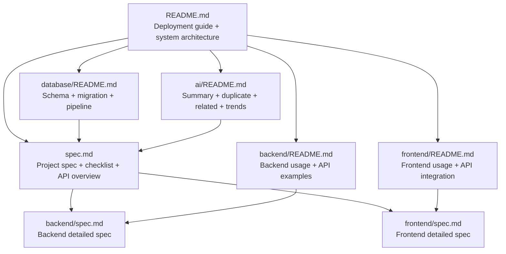
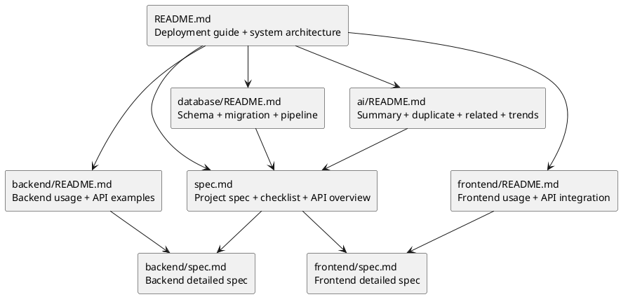

# Project Docs

Thư mục `docs/` hiện chưa chứa tài liệu chi tiết riêng. Tài liệu chính đang được đặt ở các file sau:

```txt
README.md              # Hướng dẫn start nhanh toàn hệ thống
spec.md                # Spec tổng thể, checklist và API overview
backend/README.md      # Hướng dẫn backend + API examples
backend/spec.md        # Spec chi tiết backend
frontend/README.md     # Hướng dẫn frontend và trạng thái tích hợp API
frontend/spec.md       # Spec chi tiết frontend
database/README.md     # Hướng dẫn database, crawler, pipeline và schema
ai/README.md           # Hướng dẫn AI summary, duplicate checker, related finder và trend analyzer
```

## Sơ Đồ Kiến Trúc Tài Liệu Tổng Thể



### Sơ Đồ Kiến Trúc Tài Liệu Tổng Thể - PlantUML



## Trạng Thái Hiện Tại

- Backend đã có core APIs và các API mở rộng đang được Frontend dùng: manual crawler refresh, history, related papers, duplicate/matching papers, ratings, notifications, notification SSE và topic trends.
- Database đã có cả schema core/advanced, pipeline tạo notification gộp theo topic, related papers, duplicate matching, summary batch, rating average và topic trend bằng AI/fallback.
- Frontend đã tích hợp các API chính với Backend: dashboard, search, topics, manual refresh, favorites, history, paper detail, related/matching, rating, notifications và trend.
- Phần còn thiếu chính hiện tại: forgot/reset password thật, UI sửa trực tiếp chủ đề đang theo dõi nếu vẫn muốn giữ luồng update, notes cho paper interaction và tài liệu sơ đồ ERD.
