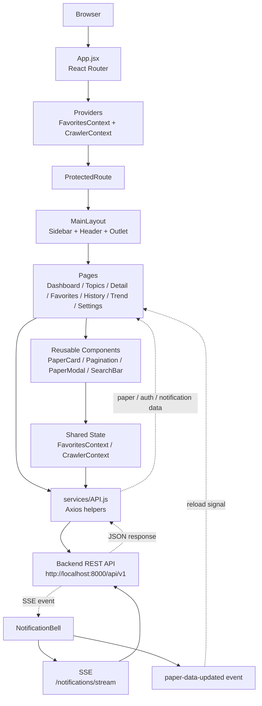
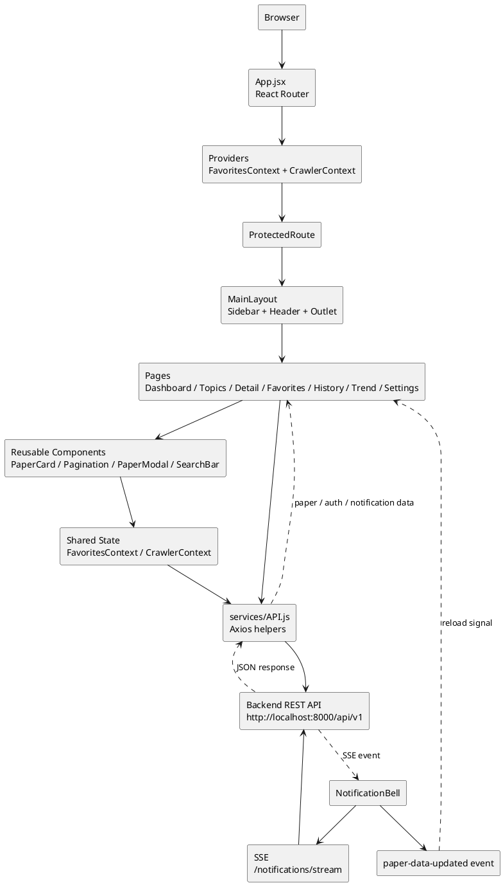

# Frontend Module - React + Vite

## 1. Chức Năng Chính

Frontend hiện có các màn hình/chức năng:

| Nhóm | Trạng thái FE | Ghi chú tích hợp BE |
| --- | --- | --- |
| Auth | Có Login/Register/Settings | BE đã có register/login/me/profile/change-password |
| Dashboard papers | Có danh sách, filter, search, pagination, nút tải lại 5 paper mới nhất | BE đã có `/papers`, `/papers/search` và `/crawler/run` |
| Topics | Có trang xem topic, trang chủ đề đang theo dõi và nút tải lại theo topic | BE đã có `/topics`, `/user-topics` và `/crawler/run` |
| Favorites | Có lưu/bỏ lưu/lấy danh sách yêu thích | BE đã có `/favorites` và `/papers/favorite/:id` |
| Paper detail | Có chi tiết, summary fallback, related, matching, rating UI | BE đã có detail/summary/favorite/related/matching/rating |
| History | Có page lịch sử đọc | BE đã có `/history` |
| Notifications | Có `NotificationBell` trong header, auto refresh danh sách paper khi SSE báo paper mới | BE đã có `/notifications`, mark-read APIs và SSE `/notifications/stream` |
| Trend | Có page `/trend` | BE đã có `/stats/topics/trends` |

## 2. Sơ Đồ Kiến Trúc Tổng Thể



### 2.1. Sơ Đồ Kiến Trúc Tổng Thể - PlantUML



## 3. Cấu Trúc File Hiện Tại

```txt
frontend/
|-- README.md
|-- spec.md
|-- package.json
|-- src/
    |-- App.jsx
    |-- main.jsx
    |-- services/
    |   |-- API.js
    |-- utils/
    |   |-- notificationRefreshEvent.js
    |   |-- paperRefreshEvent.js
    |-- contexts/
    |   |-- FavoritesContext.jsx
    |   |-- CrawlerContext.jsx
    |-- components/
    |   |-- MainLayout.jsx
    |   |-- Sidebar.jsx
    |   |-- SearchBar.jsx
    |   |-- NotificationBell.jsx
    |   |-- Pagination.jsx
    |   |-- PaperCard.jsx
    |   |-- PaperModal.jsx
    |-- page/
        |-- LoginPage.jsx
        |-- RegisterPage.jsx
        |-- DashboardPage.jsx
        |-- TopicsPage.jsx
        |-- TrackingTopicPage.jsx
        |-- FavoritesPage.jsx
        |-- HistoryPage.jsx
        |-- TrendPage.jsx
        |-- PaperDetailPage.jsx
        |-- Settingpage.jsx
```

## 4. Setup Môi Trường

Chạy từ thư mục `frontend/`:

```powershell
npm install
```

Tạo file `.env` nếu cần đổi Backend URL:

```env
VITE_API_URL=http://localhost:8000/api/v1
```

Nếu không có `.env`, FE dùng mặc định:

```txt
http://localhost:8000/api/v1
```

## 5. Hướng Dẫn Sử Dụng

Chạy dev server:

```powershell
npm run dev
```

Build kiểm tra:

```powershell
npm run build
```

## 6. Ghi Chú Tích Hợp API

Các API FE đang gọi chính hiện đã có route Backend tương ứng: papers, search, topics, user-topics, favorites, history, manual crawler refresh, related/matching papers, ratings, notifications và topic trends.

Các điểm còn để sau:

- `forgotPassword()` đang được chuẩn bị sẵn trong `API.js`, nhưng UI hiện tại chưa gọi API này và Backend chưa implement reset password thật.
- Backend đã có `PUT /user-topics/:topicId`, nhưng Frontend hiện chỉ thêm/bỏ theo dõi chủ đề, chưa có UI sửa chủ đề theo dõi.
- Notification realtime đã cập nhật chuông thông báo qua SSE; Dashboard, Topics, Tracking Topics và Trend Page tự refresh danh sách paper/topic khi crawler có paper mới.
- Manual refresh dùng `CrawlerContext` và `GET /crawler/status`, nên Backend nhận job rồi trả response ngay, còn FE giữ trạng thái đang tải lại khi người dùng đổi page rồi quay lại. Backend có cooldown mặc định 20 giây để tránh spam arXiv; Dashboard/Topics hiển thị countdown chờ mà không ẩn danh sách paper.
- Nút tải lại ở Dashboard và theo topic không hiện thông báo hoàn tất trực tiếp trên page; nếu crawler thêm được paper mới, notification được lưu vào DB và hiện trong chuông thông báo của user vừa bấm.
